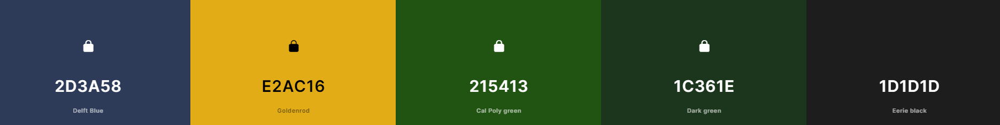

# Milestone Project 2

For my milestone project, I have chosen to create a quiz game focused on Stargate SG1 TV Series. 

I plan to utilize the knowledge and experience gained from Milestone 1, which involved HTML/CSS and Bootstrap, to construct this project. In addition, I will build upon this foundation by incorporating JavaScript, thereby demonstrating my proficiency in this particular area of study.

## Table of Contents: 

- [User Experience](#)
    - [User Stories](#)
    - [User Design](#)
       

## User Experience

### User Stories

As a first time user:

- I want to play a game where I can test my knowledge.
- I want the app to be visually appealing.
- I want to be able to navigate easily.
- I want to be able to understand how the game works.
- I want the game to be accesible on my mobile phone.

As a returning user:

- I want the questions to be varied.
- I want to be informed when I get an answer wrong, and what the right answer is.
- I want to keep track of my score on each game.
- I want to be able to jump straight in to playing.
- I want to be able to reset the questions.

As a frequent user:

- I want to be able to change the difficulty of the game.
- I want the game to be timed questions.
- I want to be able to view social media for other games/quizzes.

### Design

To create the quiz game, I plan to develop a single-page layout that will include instructions and a FAQ section, displayed via a modal created with the Bootstrap framework. Since the quiz will be centered around Stargate SG1, I believe it's fitting to incorporate a theme that reflects the main factions from the series, such as the Goa'uld and the Tauri.

1. **Font**

Keeping in the theme of Stargate, I have opted for a font that, in my opinion, bears resemblance to the primary title font used in the television series. I've made the choice of utilizing the [Lora](https://fonts.google.com/specimen/Lora?preview.text=stargate&preview.text_type=custom) Google font, with backup fonts of Georgia and serif. Font-weights are to include regular(400) & medium(500). I haven't picked a bold font as the weight of the font pushes the visual away from the original SG1 heading.

2. **Colours**

Representing both the Goa'uld (specifically the uniforms and ships) and the Tauri(uniforms and Stargate command), I have chosen the below colours. 

3. **Imagery** 

Most of the imagery has been used, will have a sci-fi element to it. The Chappa'ai(Stargate) will be a prominent image on the quiz app/site.