# Milestone Project 2

For my milestone project, I have chosen to create a quiz game focused on Stargate SG1 TV Series. 

I plan to utilize the knowledge and experience gained from Milestone 1, which involved HTML/CSS and Bootstrap, to construct this project. In addition, I will build upon this foundation by incorporating JavaScript, thereby demonstrating my proficiency in this particular area of study.

The site comprises a single page that displays certain elements at specific junctures during gameplay, while concealing others. In retrospect, it might have been more prudent to divide the site into three separate pages, one for showcasing the buttons, another for displaying the gameHud, and a third for presenting the scoreboard.

## Table of Contents: 

- [User Experience]()
    - [Client Goals](#client-goals)
    - [User Stories](#user-stories)
- [Design](#design)
    - [Font](#font)
    - [Colours](#colours)
    - [Imagery](#imagery)
    - [Wireframes](#wireframes)
    - [Structure](#structure)
- [Languages Used](#languages-used)
- [Technologies Used](#technologies-used)
- [Testing.md](#testing)
- [Future Implementations](#future-implementations)
- [Credits](#credits)
- [My Final Thoughts](#my-final-thoughts)
    
## User Experience

### Client Goals

As the client, my goal for this website is to achieve a functional quiz that works well and provides a good user experience, as well as an aesthetically pleasing and responsive design that is easy to navigate and use.

- Functional quiz: The client's goal is to have a quiz on the website that works correctly and provides a good user experience.
- Aesthetically pleasing: The client's goal is to have a website that looks attractive and visually appealing to users.
- Responsive: The client's goal is to have a website that works well on all devices, including desktops, tablets, and smartphones.
- Intuitive: The client's goal is to have a website that is easy to navigate and use, even for users who are not familiar with the site.

### User Stories

As a first time user:

- I want to play a game where I can test my knowledge.
- I want the app to be visually appealing.
- I want to be able to navigate easily.
- I want to be able to understand how the game works.
- I want the game to be accesible on my mobile phone.

As a returning user:

- I want the questions to be varied.
- *I want to be informed when I get an answer wrong, and what the right answer is.*
- I want to keep track of my score on each game.
- I want to be able to jump straight in to playing.
- I want to be able to reset the questions.

As a frequent user:

- I want to be able to change the difficulty of the game.
- I want the game to be timed questions.
- I want to be able to view social media for other games/quizzes.

## Design

To create the quiz game, I plan to develop a single-page layout that will include instructions and a FAQ section, displayed via a modal created with the Bootstrap framework. Since the quiz will be centered around Stargate SG1, I believe it's fitting to incorporate a theme that reflects the main factions from the series, such as the Goa'uld and the Tauri.

###  Font

Keeping in the theme of Stargate, I have opted for a font that, in my opinion, bears resemblance to the primary title font used in the television series. I've made the choice of utilizing the [Lora](https://fonts.google.com/specimen/Lora?preview.text=stargate&preview.text_type=custom) Google font, with backup fonts of Georgia and serif. Font-weights are to include regular(400) & medium(500). I haven't picked a bold font as the weight of the font pushes the visual away from the original SG1 heading.

### Colours

Representing both the Goa'uld (specifically the uniforms and ships) and the Tauri(uniforms and Stargate command), I have chosen the below colours. 

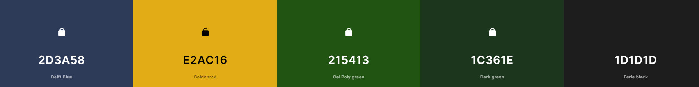

*Edit: In the end, I only used one of these colors, and instead relied on the background and Bootstrap buttons to create a visually appealing site.*

### Imagery

Most of the imagery is used, will have a sci-fi element to it. The Chappa'ai(Stargate) will be a prominent image on the quiz app/site.

*Edit: At the project's outset, I made the conscious decision to avoid incorporating any images that might be subject to copyright infringement. Consequently, I opted to employ a background image from NASA's twitter feed and placed a solitary Stargate logo at the top of the screen.*

### Wireframes

The wireframes that you see below were created using Balsamiq.

| Desktop First Page | Desktop Game| Desktop Faq |
| ------- | ------- | ------- |
| 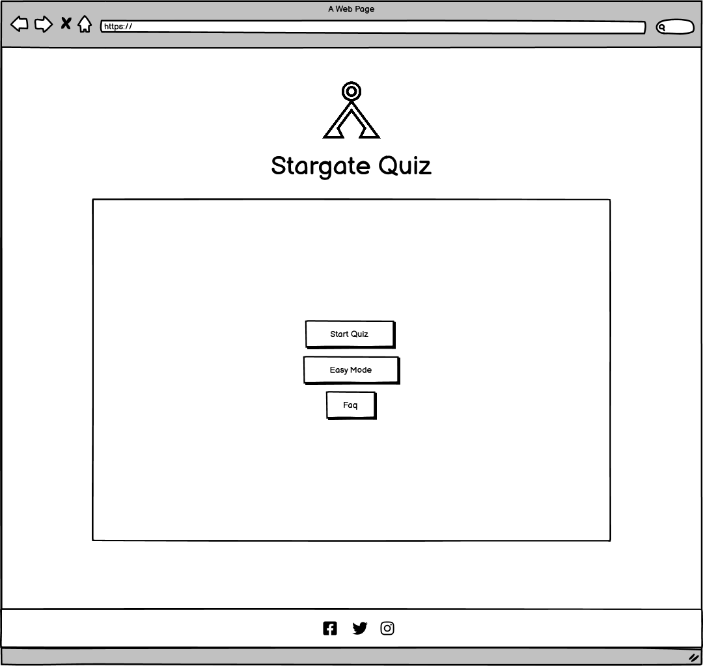 | 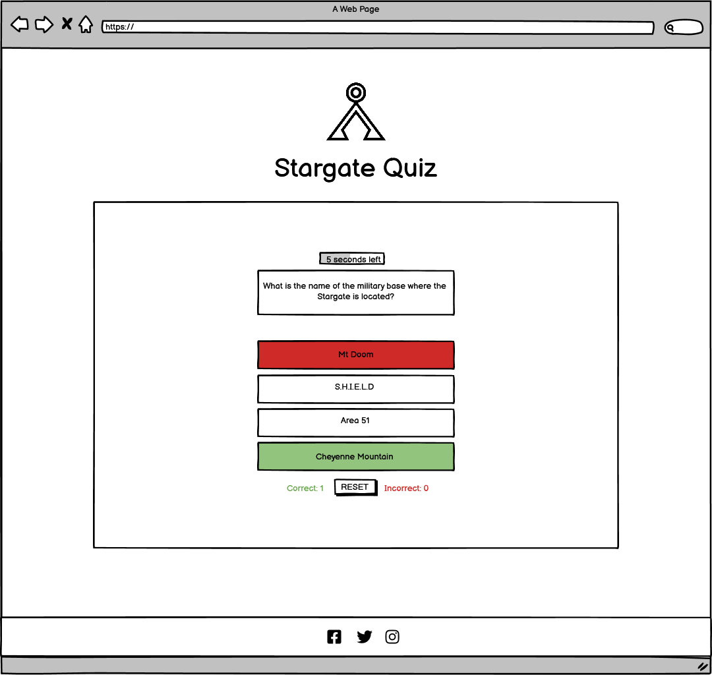 | 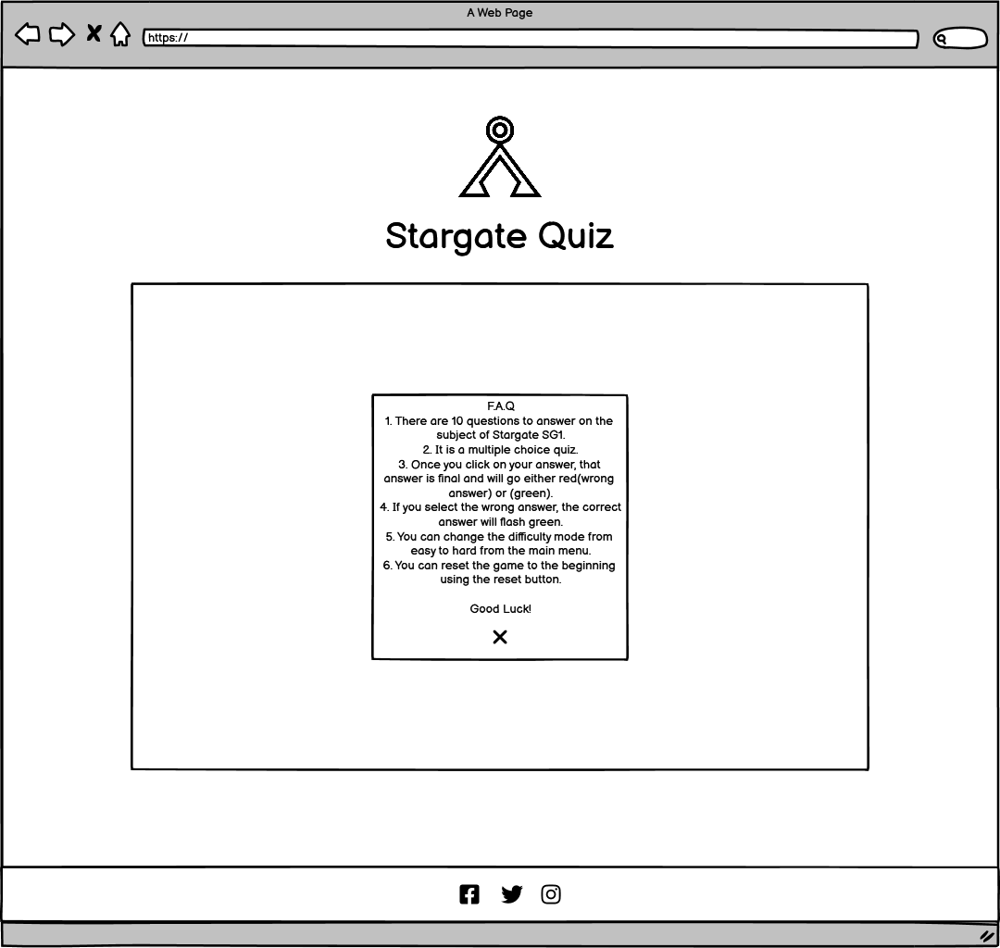 |

| Mobile First Page| Mobile Game| Mobile Faq |
| ------- | ------- | ------- |
| 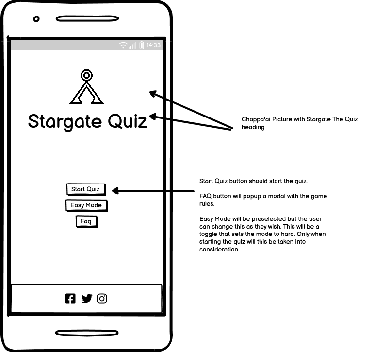 | 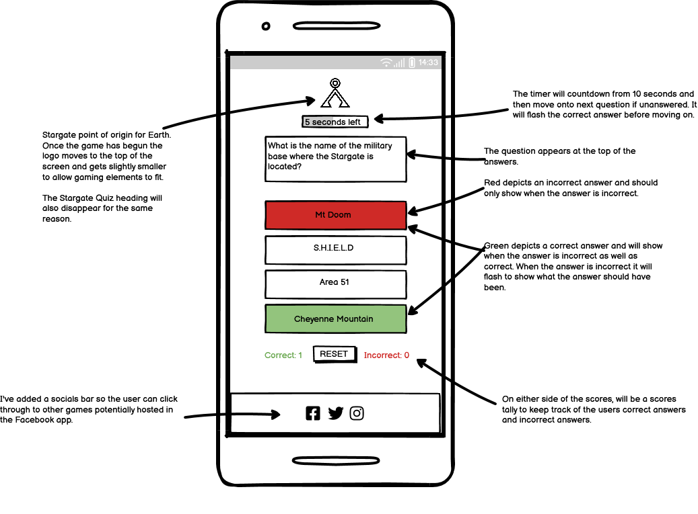 | 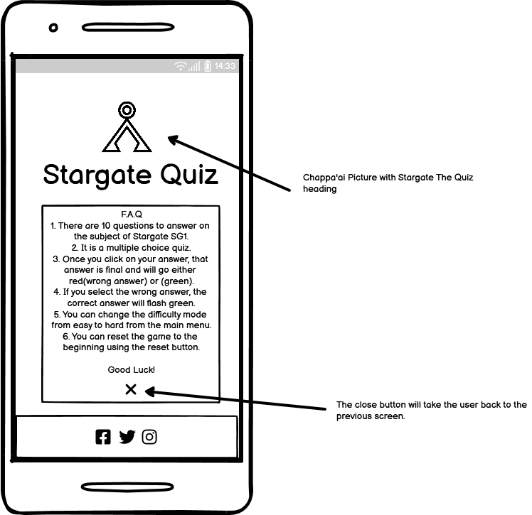 |
|         |         |         |

| Tablet First Page| Tablet Game| Tablet Faq |
| ------- | ------- | ------- |
| 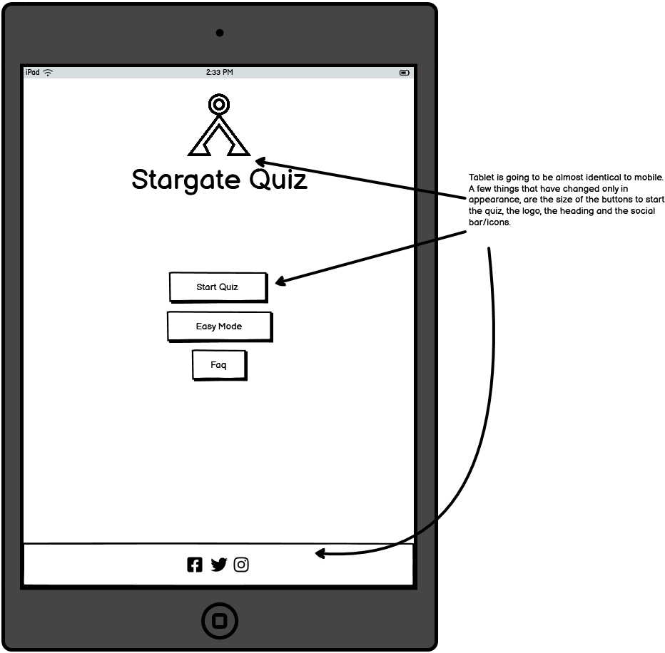 | 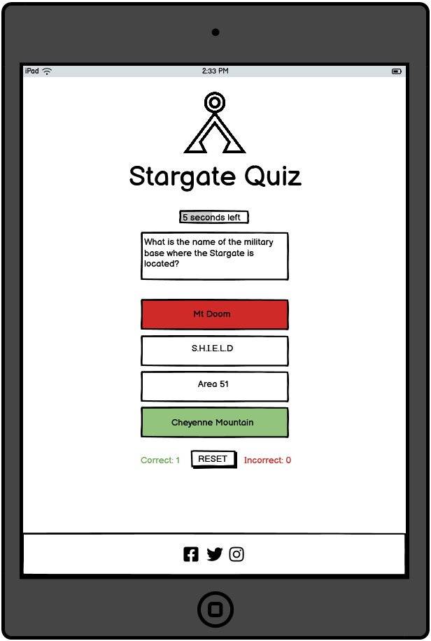 |  |
|         |         |         |

### Structure

The landing page is composed of several elements. At the top of the screen, there is a home button/symbol followed by a heading that reads 'Stargate Quiz,' with a slogan/ tagline underneath that says 'Do you dare challenge the Goa'uld? 
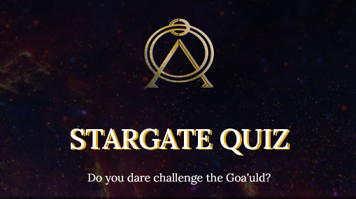

Below this is the game area, which includes the game buttons, a timer, questions, and a reset game button. The timer, questions and reset game button aren't visible until the game has started. 
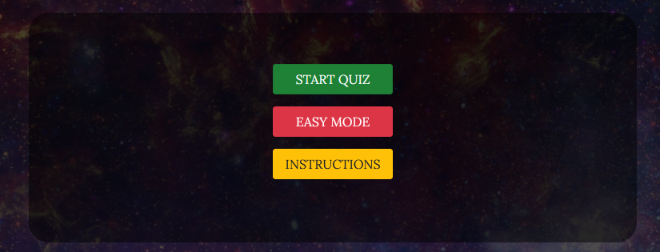

The instructions button opens a modal which explains how to use/play the game. The code used was modified from the Bootstrap Modal code. 
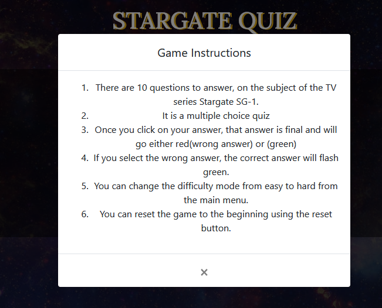

Finally, at the bottom of the page, there is a footer that features social icons created using the Font Awesome icon library. 
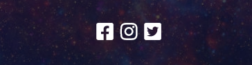

## Languages Used

* HTML - used for the basic structure of the website.
* CSS - used in conjunction with HTML & JS to style, hide and display elements.
* JavaScript - used to add interactivity to the quiz such as user feedback on correctly answered questions.

## Technologies Used

* [Balsamiq](https://balsamiq.com/) - for creating the wireframes.
* [VSCode](https://code.visualstudio.com/) - I'd hit my quota for the month so had to revert to using VSCode, downloading the repo to my HD and editing on my laptop/desktop.
* [Firefox Developer Edition](https://www.mozilla.org/en-US/firefox/developer/) - used to debug code, useful for grid/flex learning.
* [Google Chrome](https://www.google.com/chrome/) - used to identify different issues that appear in different browsers.
* [Google Fonts](https://fonts.google.com/) - I used the Lora font on the site which is imported to CSS courtesy of Google.
* [Font Awesome](https://fontawesome.com/) - used for the social media icons in the footer.
* [Bootstrap](https://getbootstrap.com/) - I used the Bootstrap(4.6) framework to enable synchronicity across the site, and also mobile first design.
* [W3Schools](https://www.w3schools.com/) - used to research JavaScript methods.
* [MDN](https://developer.mozilla.org/) - also used to research.
* [Git](https://git-scm.com/) - version control software used to keep track of changes.
* [GitHub](https://github.com/) - used to store repositories
* [Gitpod](https://www.gitpod.io/) - a cloud based IDE used to develop my MS2.
* [JSHint](https://www.jshint.com/) - JavaScript code quality tool.
* [Gimp](https://www.gimp.org/) - Photo manipulation tool used for batch resizing images.
* [BIMP](https://alessandrofrancesconi.it/projects/bimp/) - Plugin for GIMP to allow batch resizing.

## Testing

Please click the link to view my [testing.md](assets/docs/testing.md)

## Future Implementations

In the Milestone I was unable to implement the below features:- 
- On selecting an incorrect answer, the correct answer was supposed to flash green. I was able to get the answer to stay on the screen for approximately a second but unable to figure out how to do both at the same time. This is something I will work on in my spare time to ensure that I can get a solution everytime.

- I would like to be able to implement an API to obtain a wider range of questions.
- Possibly the ability to create your own quizzes so that they can be sent to friends.
  
## Credits 

* [Nasa Twitter Feed](https://twitter.com/NASA/status/677577837038186497/) - the background image that is used on the site.
* Ricardo Matos, Callum Jones & Razvan Joitescu - for sharing input and their ideas. 
* My family for being extremely patient with me.

## My Final Thoughts

The site as a whole could have been a lot better on my part, specifically the JavaScript. Although the site functions(almost) as intended and fits the client goals/user goals, it is relatively simple and straight to the point. 

I feel as though I still have an enormous amount to learn in the JS side of the journey but aI can only do this via practice. 

Juan de Avila - "La práctica hace al maestro"
