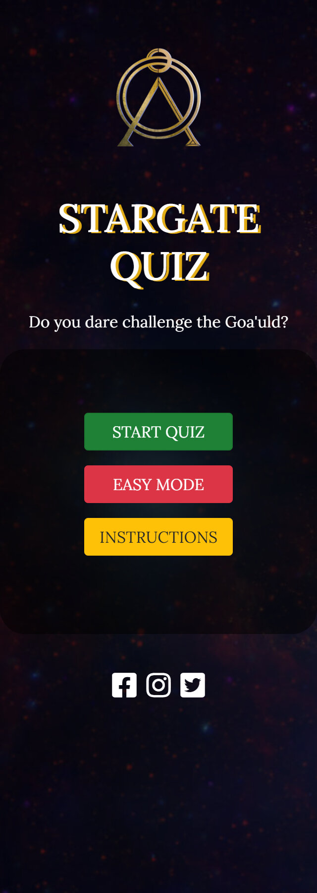
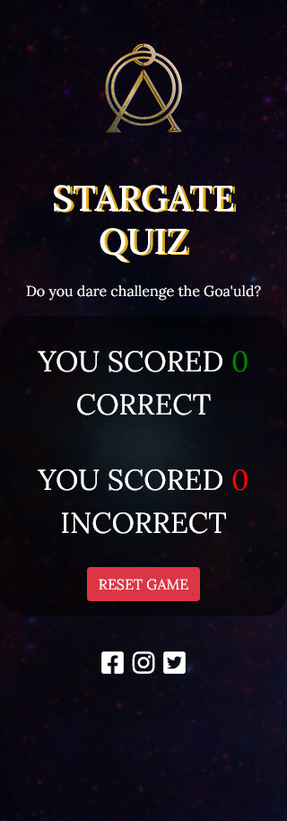
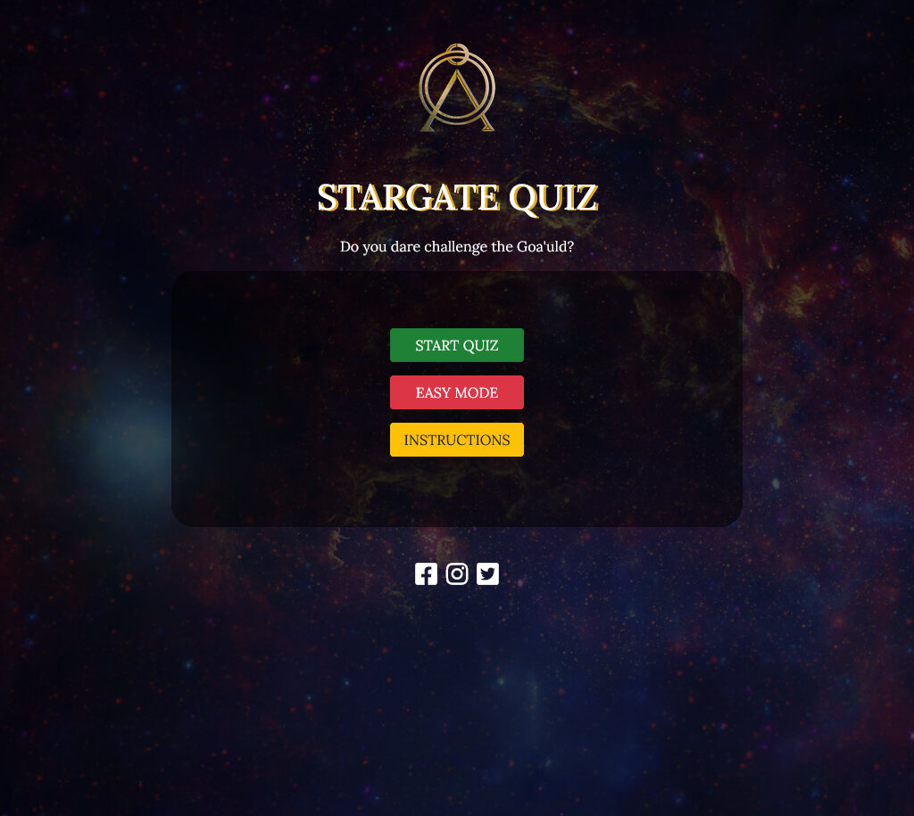
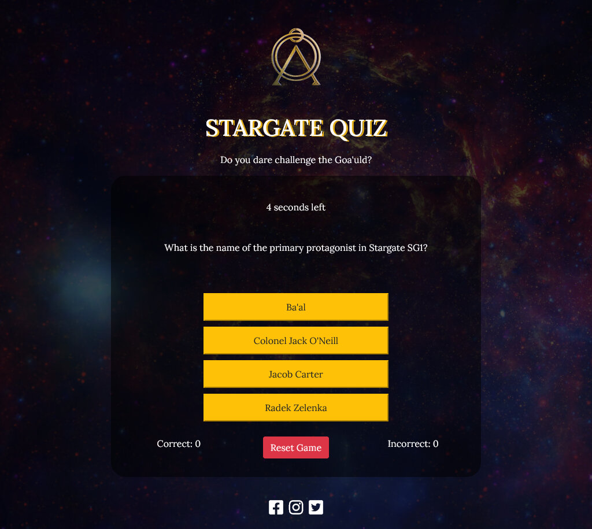
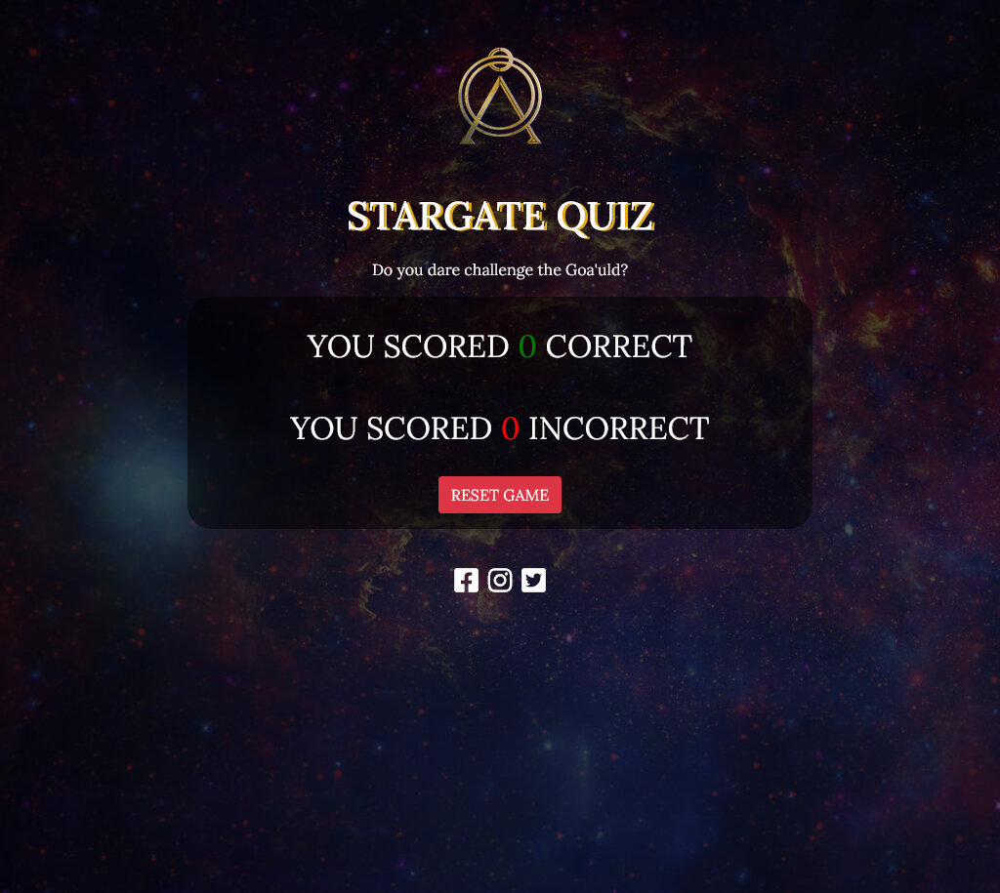

# Milestone Project 2

For my milestone project, I have chosen to create a quiz game focused on Stargate SG1 TV Series. 

I plan to utilize the knowledge and experience gained from Milestone 1, which involved HTML/CSS and Bootstrap, to construct this project. In addition, I will build upon this foundation by incorporating JavaScript, thereby demonstrating my proficiency in this particular area of study.

The site comprises a single page that displays certain elements at specific junctures during gameplay, while concealing others. In retrospect, it might have been more prudent to divide the site into three separate pages, one for showcasing the buttons, another for displaying the gameHud, and a third for presenting the scoreboard.

## Table of Contents: 

- [User Experience](#)
    - [User Stories](#)
    - [User Design](#)
       

## User Experience

### User Stories

As a first time user:

- I want to play a game where I can test my knowledge.
- I want the app to be visually appealing.
- I want to be able to navigate easily.
- I want to be able to understand how the game works.
- I want the game to be accesible on my mobile phone.

As a returning user:

- I want the questions to be varied.
- *I want to be informed when I get an answer wrong, and what the right answer is.*
- I want to keep track of my score on each game.
- I want to be able to jump straight in to playing.
- I want to be able to reset the questions.

As a frequent user:

- I want to be able to change the difficulty of the game.
- I want the game to be timed questions.
- I want to be able to view social media for other games/quizzes.

### Design

To create the quiz game, I plan to develop a single-page layout that will include instructions and a FAQ section, displayed via a modal created with the Bootstrap framework. Since the quiz will be centered around Stargate SG1, I believe it's fitting to incorporate a theme that reflects the main factions from the series, such as the Goa'uld and the Tauri.

1. **Font**

Keeping in the theme of Stargate, I have opted for a font that, in my opinion, bears resemblance to the primary title font used in the television series. I've made the choice of utilizing the [Lora](https://fonts.google.com/specimen/Lora?preview.text=stargate&preview.text_type=custom) Google font, with backup fonts of Georgia and serif. Font-weights are to include regular(400) & medium(500). I haven't picked a bold font as the weight of the font pushes the visual away from the original SG1 heading.

2. **Colours**

Representing both the Goa'uld (specifically the uniforms and ships) and the Tauri(uniforms and Stargate command), I have chosen the below colours. 

3. **Imagery** 

Most of the imagery is used, will have a sci-fi element to it. The Chappa'ai(Stargate) will be a prominent image on the quiz app/site.

Edit: At the project's outset, I made the conscious decision to avoid incorporating any images that might be subject to copyright infringement. Consequently, I opted to employ a background image from NASA's twitter feed and placed a solitary Stargate logo at the screen's apex.  

4. **Wireframes** 

The wireframes that you see below were created using Balsamiq.

| Desktop First Page | Desktop Game| Desktop Faq |
| ------- | ------- | ------- |
|  |  |  |

| Mobile First Page| Mobile Game| Mobile Faq |
| ------- | ------- | ------- |
|  |  |  |
|         |         |         |

| Tablet First Page| Tablet Game| Tablet Faq |
| ------- | ------- | ------- |
|  |  |  |
|         |         |         |

## Languages Used

* HTML - used for the basic structure of the website.
* CSS - used in conjunction with HTML & JS to style, hide and display elements.
* JavaScript - used to add interactivity to the quiz such as user feedback on correctly answered questions.

## Technologies Used

* [Balsamiq](https://balsamiq.com/) - for creating the wireframes.
* [VSCode](https://code.visualstudio.com/) - I'd hit my quota for the month so had to revert to using VSCode, downloading the repo to my HD and editing on my laptop/desktop.
* [Firefox Developer Edition](https://www.mozilla.org/en-US/firefox/developer/) - used to debug code, useful for grid/flex learning.
* [Google Chrome](https://www.google.com/chrome/) - used to identify different issues that appear in different browsers.
* [Google Fonts](https://fonts.google.com/) - I used the Lora font on the site which is imported to CSS courtesy of Google.
* [Font Awesome](https://fontawesome.com/) - used for the social media icons in the footer.
* [Bootstrap](https://getbootstrap.com/) - I used the Bootstrap(4.6) framework to enable synchronicity across the site, and also mobile first design.
* [W3Schools](https://www.w3schools.com/) - used to research JavaScript methods.
* [MDN](https://developer.mozilla.org/) - also used to research.
* [Git](https://git-scm.com/) - version control software used to keep track of changes.
* [GitHub](https://github.com/) - used to store repositories
* [Gitpod](https://www.gitpod.io/) - a cloud based IDE used to develop my MS2.
* [JSHint](https://www.jshint.com/) - JavaScript code quality tool.
* [Gimp](https://www.gimp.org/) - Photo manipulation tool used for batch resizing images.
* [BIMP](https://alessandrofrancesconi.it/projects/bimp/) - Plugin for GIMP to allow batch resizing.

## Testing

### Table Of Contents
- [Code Validation](#)

## Code Validation

Each page produced by myself has been ran through W3C HTML & CSS Checkers and found no errors. JS was ran through JSHint to validate/check code.
       
| Language | URLS | Evidence |
| -------- | -------- | -------- |
| HTML     | Deployed Site Results W3C | [W3C HTML Validation PDF](assets/docs/w3chtmlvalid.pdf "W3C Valid HTML PDF") |
| CSS      | Deployed Site Results W3C | [W3C CSS Validation PDF](assets/docs/w3cvalidcss.pdf "W3C Valid CSS PDF") |
| JS       |          |  |

## Responsive Testing

In the below table, I have added screenshots of each resolution, at each point in the game. There was no artifacts or bugs that were detected visually or via DevTools.

| Device   | Landing Page                                      | Quiz Page                                          | Scores Page                                        | Comments |
| -------- | ------------------------------------------------- | -------------------------------------------------- | -------------------------------------------------- | -------- |
| Mobile   | |  |                    |Each page displays as it should with no visible artifacts or issues. These were all tested at a resolution of 320px and above.          |
| Tablet   |      |            |        |Each page displays as it should with no visible artifacts or issues. These were all tested at a resolution of 768px and above.          |
| Desktop  |    |          |      |Each page displays as it should with no visible artifacts or issues. These were all tested at a resolution of 1024px and above.          |

## Functional Testing

| Test Case | Description | Test Steps | Expected Result | Actual Result | Pass/Fail |
| --- | --- | --- | --- | --- | --- |
| Start Quiz | Does the game start correctly| 1. Click Start Quiz Button   2. JS populates the questions 3. User answers the question.   4. Receive interaction feedback | User is able to start the quiz, read the random question displayed and choose an answer. All within a time limit of 30 seconds. | PASS | PASS   |
| Difficulty Toggle | Test Difficulty Toggle | 1. Click Easy Mode Toggle   2. Click Start Quiz   | User is successfully able to select a question set. | PASS | PASS   |
| Instructions | Test the modal on the website | 1. Click the Instructions button   2. Close the intructions modal| Instructions Modal shows how instructions on how to play the game. Closes when X is clicked. | PASS | PASS   |
| Picking an Answer | Test if user can select correct answers | 1. Select an answer   2. Receive interaction feedback   3. Repeat process until time runs out    | User is able to select wrong and right answers. User is also able to select multiple answers which is not intended | PASS | FAIL   |
| Reset The Game | Test the reset button on gameHud and scoreboard | 1. Click the reset button   2. Select option to start or change difficulty   3. Start the game again    | User can successfully use the reset button on both gameHud and scoreboard screens.| PASS | PASS|
| Social Media Icons | Test if icons work correctly | 1. Click each icon   2. Verify that they open in new window    | User can successfully go through to social media sites.| PASS | PASS|

## Future Implementations

In the Milestone I was unable to implement the below features:- 
- On selecting an incorrect answer, the correct answer was supposed to flash green. I was able to get the answer to stay on the screen for approximately a second but unable to figure out how to do both at the same time. This is something I will work on in my spare time to ensure that I can get a solution everytime.
  

## Credits 

* [Nasa Twitter Feed](https://twitter.com/NASA/status/677577837038186497/) - the background image that is used on the site.
* Ricardo Matos, Callum Jones & Razvan Joitescu - for sharing input and their ideas. 
* My family for being extremely patient with me.