## Testing

### Table Of Contents
- [Code Validation](#code-validation)
- [Responsive Testing](#responsive-testing)
- [Lighthouse Results](#lighthouse-test-results)

## Code Validation

Each page produced by myself has been ran through W3C HTML & CSS Checkers and found no errors. Javascript was put through JSHint and
       
| Language | URLS | Evidence |
| -------- | -------- | -------- |
| HTML     | Deployed Site Results W3C | [W3C HTML Validation PDF](w3chtmlvalid.pdf "W3C Valid HTML PDF") |
| CSS      | Deployed Site Results W3C | [W3C CSS Validation PDF](w3cvalidcss.pdf "W3C Valid CSS PDF") |
| JS       |          | 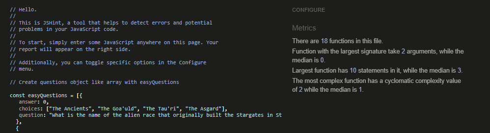 |

## Responsive Testing

In the below table, I have added screenshots of each resolution, at each point in the game. There was no artifacts or bugs that were detected visually or via DevTools.

| Device   | Landing Page                                      | Quiz Page                                          | Scores Page                                        | Comments |
| -------- | ------------------------------------------------- | -------------------------------------------------- | -------------------------------------------------- | -------- |
| Mobile   | 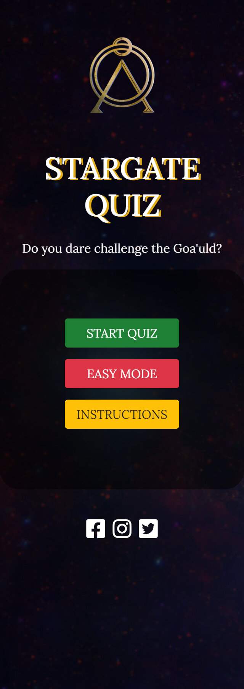| 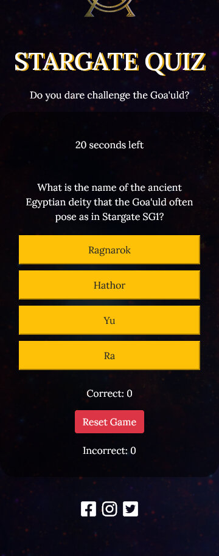 | 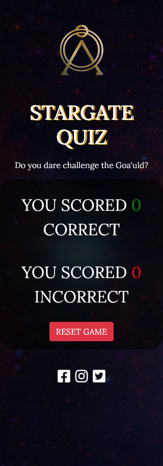                   |Each page displays as it should with no visible artifacts or issues. These were all tested at a resolution of 320px and above.          |
| Tablet   | 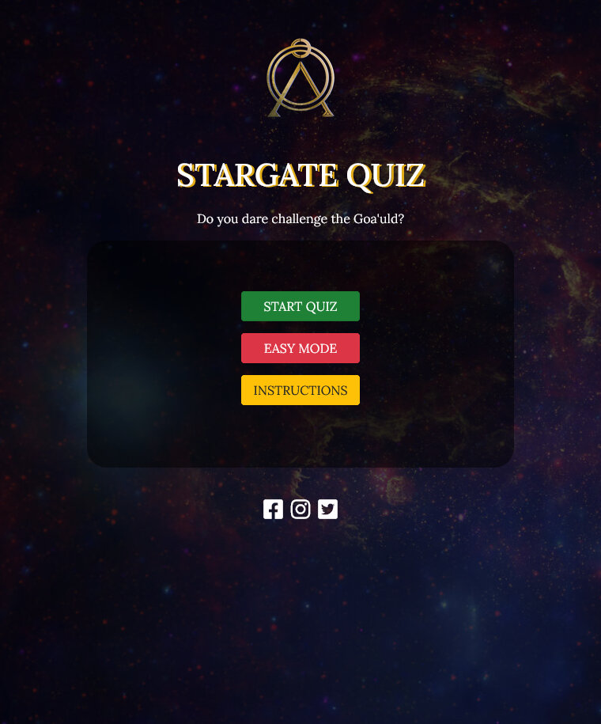     | 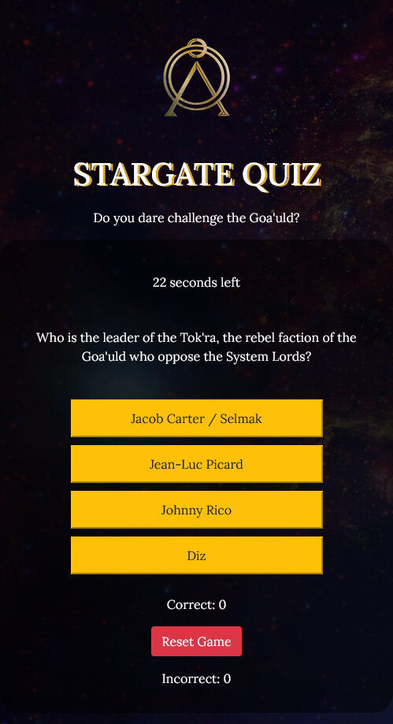           | 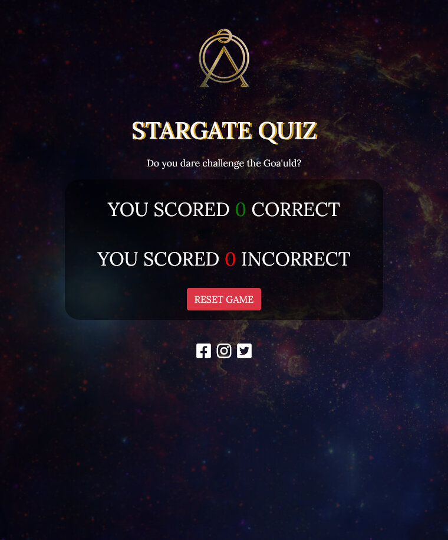       |Each page displays as it should with no visible artifacts or issues. These were all tested at a resolution of 768px and above.          |
| Desktop  | 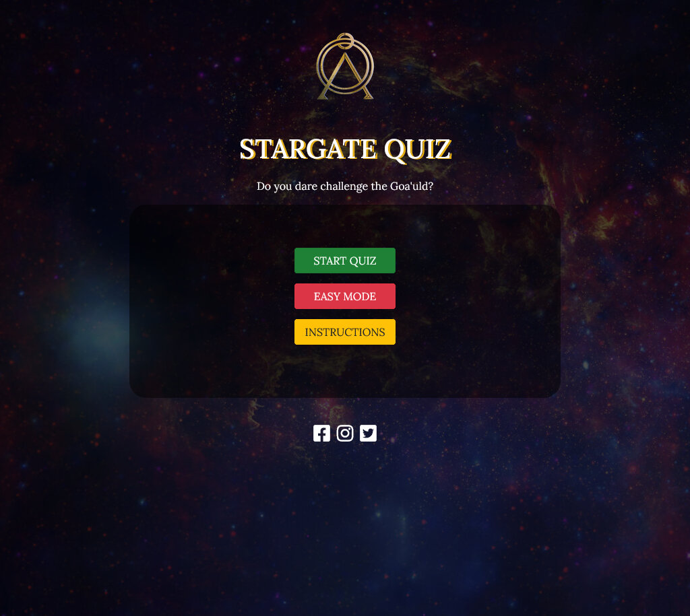   | 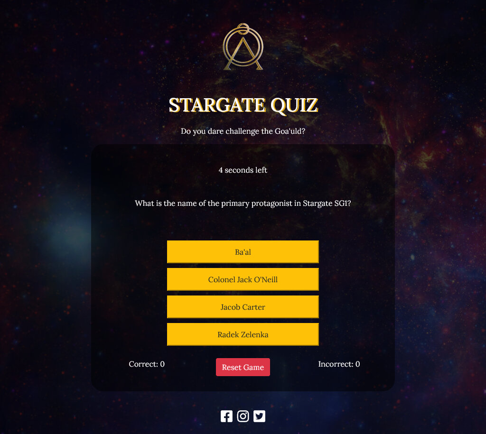         | 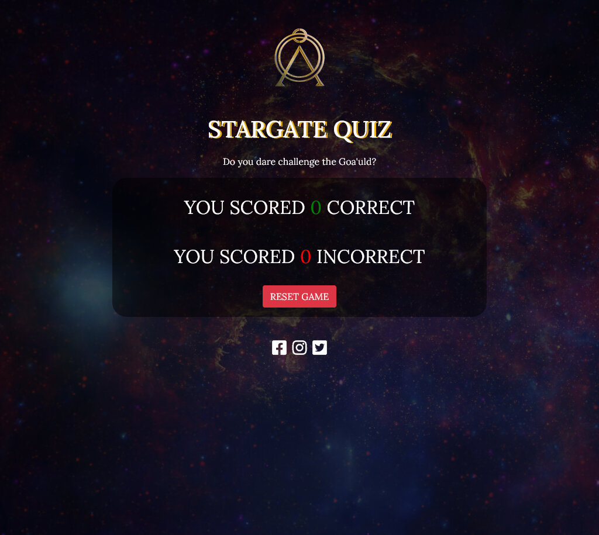     |Each page displays as it should with no visible artifacts or issues. These were all tested at a resolution of 1024px and above.          |

## Lighthouse Test Results

I identified several areas for improvement on my website using Lighthouse, including:

* Missing aria-labels on social media icon links: I added descriptive labels to provide users who rely on screen readers with information on the function of the buttons.
* Lack of meta description: I added a meta description to improve my website's SEO scores.
* Use of outdated file format: Lighthouse suggested switching to a more next-gen file format instead of jpeg. I converted my image files to webp format using the BIMP plugin for GIMP to batch convert files.

The following is the result of the automated testing conducted in Lighthouse for the Desktop version of the website:
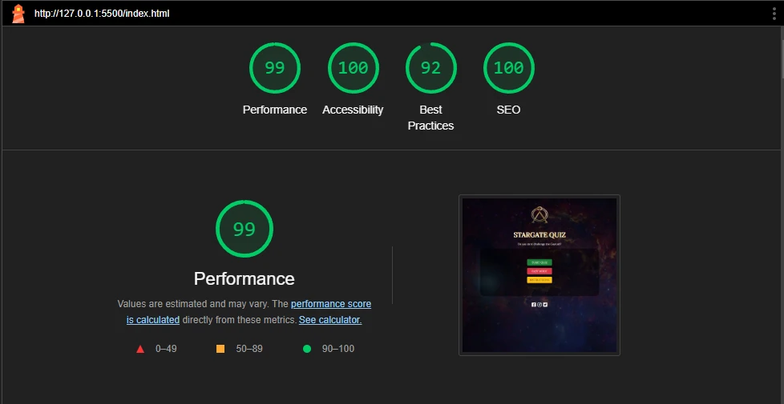

The following is the result of the automated testing conducted in Lighthouse for the Mobile version of the website:
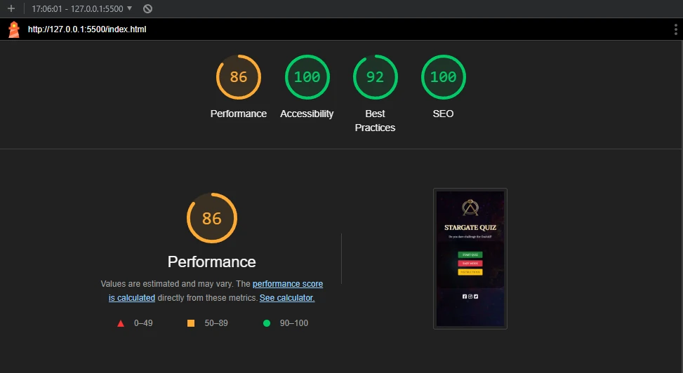

## Functional Testing

| Test Case | Description | Test Steps | Expected Result | Actual Result | Pass/Fail |
| --- | --- | --- | --- | --- | --- |
| Start Quiz | Does the game start correctly| 1. Click Start Quiz Button   2. JS populates the questions 3. User answers the question.   4. Receive interaction feedback | User is able to start the quiz, read the random question displayed and choose an answer. All within a time limit of 30 seconds. | PASS | PASS   |
| Difficulty Toggle | Test Difficulty Toggle | 1. Click Easy Mode Toggle   2. Click Start Quiz   | User is successfully able to select a question set. | PASS | PASS   |
| Instructions | Test the modal on the website | 1. Click the Instructions button   2. Close the intructions modal| Instructions Modal shows how instructions on how to play the game. Closes when X is clicked. | PASS | PASS   |
| Picking an Answer | Test if user can select correct answers | 1. Select an answer   2. Receive interaction feedback   3. Repeat process until time runs out    | User is able to select wrong and right answers. User is also able to select multiple answers which is not intended | PASS | FAIL   |
| Reset The Game | Test the reset button on gameHud and scoreboard | 1. Click the reset button   2. Select option to start or change difficulty   3. Start the game again    | User can successfully use the reset button on both gameHud and scoreboard screens.| PASS | PASS|
| Social Media Icons | Test if icons work correctly | 1. Click each icon   2. Verify that they open in new window    | User can successfully go through to social media sites.| PASS | PASS|

