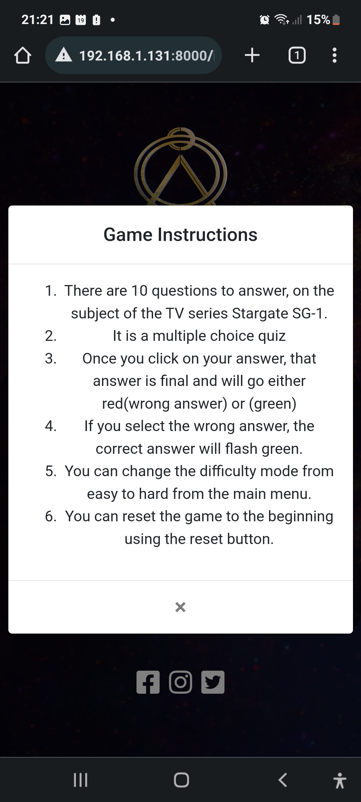

# Testing

Back to [README.md](../../README.md).

## Table Of Contents
- [Code Validation](#code-validation)
- [Browser Testing](#browser-testing)
    - [Mobile Browser Testing](#mobile-browser-testing)
- [Responsive Testing](#responsive-testing)
- [Lighthouse Results](#lighthouse-test-results)
- [Functional Testing](#functional-testing)
- [UX Goal Alignment](#ux-goal-alignment)
- [Bug Tracker](#bug-tracker)
    - [Open Bugs](#open-bugs)
    - [Resolved Bugs](#resolved-bugs)
    - [Other Issues](#other-issues)

### Code Validation

Each page produced by myself has been ran through W3C HTML & CSS Checkers and found no errors. Javascript was put through JSHint and
       
| Language | URLS | Evidence |
| -------- | -------- | -------- |
| HTML     | Deployed Site Results W3C | [W3C HTML Validation PDF](w3chtmlvalid.pdf "W3C Valid HTML PDF") |
| CSS      | Deployed Site Results W3C | [W3C CSS Validation PDF](w3cvalidcss.pdf "W3C Valid CSS PDF") |
| JS       |   |

### Browser Testing

I manually tested the browsers below performing the same actions such as:- 
- Manually resizing each browser window and looking for any unexpected changes at specific breakpoints(320px , 768px and 1024px)
- Walking through the steps found in the functional testing table to establish any code issues.

| Browser | Responsive All Sizes  | URL to Screenshot | 
| ---- | -------- | ------------------|
| Opera|  PASS    |        | [Opera Screenshot](images/opera_desktop.png "Opera Desktop") |
| Edge |   PASS    |          | [Edge Screenshot](images/microsoft_edge.png "Edge Desktop") |
| Firefox Developer | PASS  |          | [Firefox Screenshot](images/firefox_developer.png "Firefox Desktop") |
| Chrome   | PASS    |       |       [Chrome Screenshot](images/google_chrome.png "Chrome Desktop") |
| Combination of Browsers |PASS|       |       [Combination of Browsers](images/opera_edge_chrome_ffdev.png "Opera, Edge, FF Dev, Chrome Screenshot") |

### Mobile Browser Testing

The site was tested on my personal Samsung Galaxy A72 and appeared to show no problems. Again, I played the game as a user would and got my family to play the game. 

Other than what is detailed in the [Bug Tracker](#bug-tracker) there was no additional issues.

### Responsive Testing

In the below table, I have added screenshots of each resolution, at each point in the game. There was no artifacts or bugs that were detected visually or via DevTools. I resized the window to the most common breakpoints to test if the site was truely responsive.

| Device   | Landing Page                                      | Quiz Page                                          | Scores Page                                        | Comments |
| -------- | ------------------------------------------------- | -------------------------------------------------- | -------------------------------------------------- | -------- |
| Mobile   | |  |                    |Each page displays as it should with no visible artifacts or issues. These were all tested at a resolution of 320px and above.          |
| Tablet   |      |            |        |Each page displays as it should with no visible artifacts or issues. These were all tested at a resolution of 768px and above.          |
| Desktop  |    |          |      |Each page displays as it should with no visible artifacts or issues. These were all tested at a resolution of 1024px and above.          |

### Lighthouse Test Results

I identified several areas for improvement on my website using Lighthouse, including:

* Missing aria-labels on social media icon links: I added descriptive labels to provide users who rely on screen readers with information on the function of the buttons.
* Lack of meta description: I added a meta description to improve my website's SEO scores.
* Use of outdated file format: Lighthouse suggested switching to a more next-gen file format instead of jpeg. I converted my image files to webp format using the BIMP plugin for GIMP to batch convert files.

The following is the result of the automated testing conducted in Lighthouse for the Desktop version of the website:

The following is the result of the automated testing conducted in Lighthouse for the Mobile version of the website:

### Functional Testing

| Test Case | Description | Test Steps | Expected Result | Actual Result | Pass/Fail |
| --- | --- | --- | --- | --- | --- |
| Start Quiz | Does the game start correctly| 1. Click Start Quiz Button   2. JS populates the questions 3. User answers the question.   4. Receive interaction feedback | User is able to start the quiz, read the random question displayed and choose an answer. All within a time limit of 30 seconds. | PASS | PASS   |
| Difficulty Toggle | Test Difficulty Toggle | 1. Click Easy Mode Toggle   2. Click Start Quiz   | User is successfully able to select a question set. | PASS | PASS   |
| Instructions | Test the modal on the website | 1. Click the Instructions button   2. Close the intructions modal| Instructions Modal shows how instructions on how to play the game. Closes when X is clicked. | PASS | PASS   |
| Picking an Answer | Test if user can select correct answers | 1. Select an answer   2. Receive interaction feedback   3. Repeat process until time runs out    | User is able to select wrong and right answers. User is also able to select multiple answers which is not intended | PASS | FAIL   |
| Reset The Game | Test the reset button on gameHud and scoreboard | 1. Click the reset button   2. Select option to start or change difficulty   3. Start the game again    | User can successfully use the reset button on both gameHud and scoreboard screens.| PASS | PASS|
| Social Media Icons | Test if icons work correctly | 1. Click each icon   2. Verify that they open in new window    | User can successfully go through to social media sites.| PASS | PASS|

### UX Goal Alignment

| First Time Users | Result          |       Evidence |
| ---------------- | --------------- | -------------- |
| I want to play a game where I can test my knowledge. | Ok | The user can select answers to the questions to test their knowledge. |
|I want the app to be visually appealing. |   Ok   | The app is quite eye catching and looks good.      |
|I want to be able to navigate easily. |  Ok    |   User can navigate easily and site is intuitive.    |
|I want to be able to understand how the game works. |  Ok    | User can select the instructions button to read game rules.       |
|I want the game to be accesible on my mobile phone. |  Ok    | Tested with my personal phone, the app works on mobiles.      |

| Returning User | Result          |       Evidence |
| ---------------- | --------------- | -------------- |
| I want the questions to be varied. | Ok          | The questions are randomly chosen |
| I want to be informed when I get an answer wrong, and what the right answer is. | Needs worked          | There is no correct answer flash |
| I want to keep track of my score on each game. | Ok         | There are score counters on either side of the reset game button |
| I want to be able to jump straight in to playing. | Ok     | User can jump in straight away with simple rules and relatively simple quiz design |
| I want to be able to reset the questions.| Ok         | User can reset the game to the main page and start again. |

I don't quite understand how to fit the correct answer flash into the game at the moment but this is something I am going to keep coming back to.

| Frequent User | Result          |       Evidence |
| ---------------- | --------------- | -------------- |
| I want to be able to change the difficulty of the game. | Ok  | User can use the difficulty toggle button to switch|
| I want the game to be timed questions. | Ok   | Timer at the top of the game counts down from 30 seconds |
| I want to be able to view social media for other games/quizzes. | Ok  |       User can select any icon from the footer to view social media sites.|

### Testing Methods Used

- Manual Testing 
    - I relied heavily on manual testing for the majority of my JS. This involved passing variables/functions as arguments to the console.log method.

### Bug Tracker

### Open Bugs
- [ ] Timer element doesn't display as soon as loading into the game.
- [ ] User is able to click more than one answer
- [ ] Clicking in quick successions results in answers skipping.
- [ ] When selecting an incorrect answer, the correct answer should flash.
- [ ] Some of the questions/answers are repeating due to the way they are called.

### Resolved Bugs

- [x] Due to the answer being indexed beyond the actual length of the choices, some responses were being displayed incorrectly and without a valid answer. This was fixed for both easy and hard question sets.

- [x] Originally, the gray overlay I applied to the background only covered the viewport height, which was unintended. As a result, the overlay was modified to extend to 100% of the screen.

### Other Issues

After transitioning from using the Cloud IDE Gitpod to Code Anywhere, I decided to clone my repository to my local device. 

However, I encountered an issue where the global configurations for VSCode on my device were not set up correctly because of a previous(I own) GitHub account that was logged in. This has resulted in the appearance of two contributors to the code, when in reality there was only one. I have acknowledged this in my commits.

